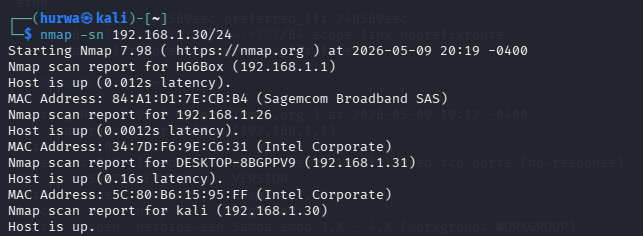
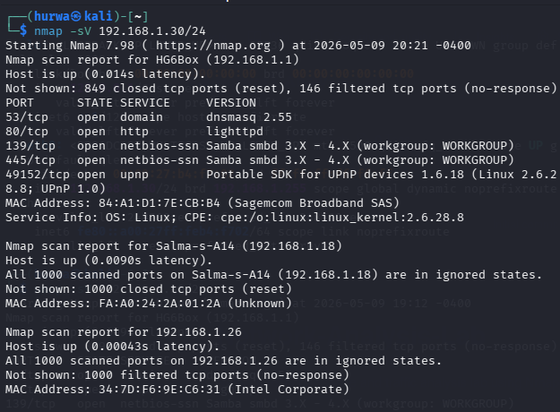
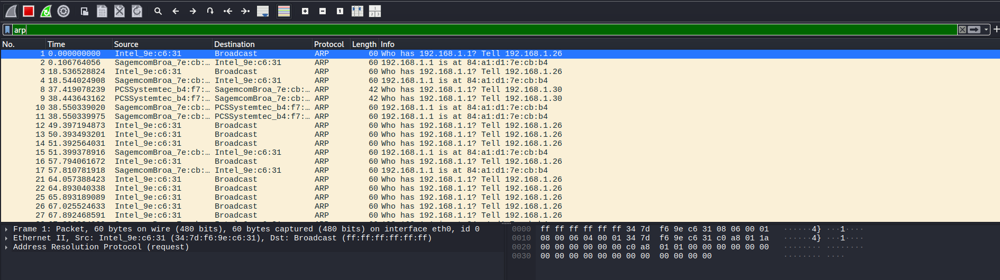
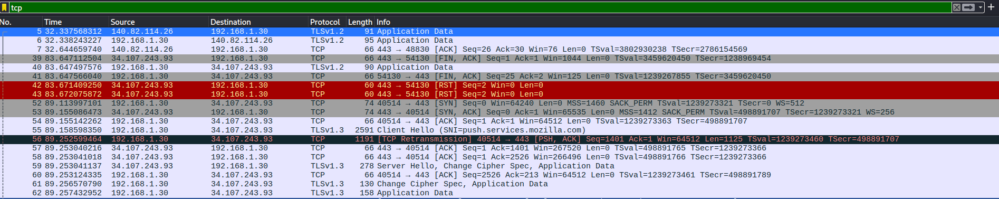

# Network Analysis Lab

This project demonstrates network reconnaissance and packet analysis using Nmap and Wireshark in Kali Linux.

## Tools Used
- Nmap
- Wireshark
- Kali Linux

## Objectives
- Discover devices on a local network
- Perform network reconnaissance
- Analyze packets generated during scans
- Understand ARP and TCP traffic

## Nmap Scans Used

### Host Discovery Scan
```bash
nmap -sn 192.168.1.0/24
```

### Service Detection Scan
```bash
nmap -sV <target-ip>
```

## Key Findings
- Active hosts were identified on the local network.
- ARP requests and TCP traffic were captured in Wireshark.
- Packet analysis demonstrated how reconnaissance traffic appears during scanning.

## Screenshots








